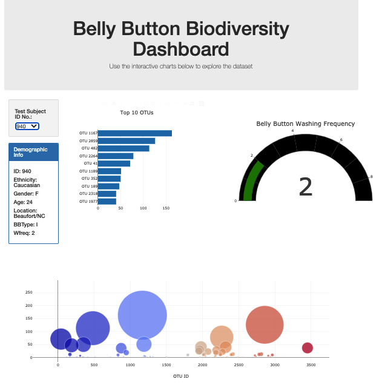

# BacteriaAnalysis

## Resources
- Software Platform: Visual Studio Code 1.47.3, Google Chrome
    - Data Sources: samples.json

### Challenge Overview
In this week's challenge, we were tasked with creating an interactive webpage that allowed users to view data analysis belly button bacteria from random testing. We utilized Plotly and the available plots such as bar charts, scatter plots, and gauge charts in order to create a visualization of the selected sample number. The Javascript file plots.js is where the code that generates the demographic information and charts is stored. The index.html file stores the template for the webpage. The webpage is setup to view sample ID number 940 upon initial page load. In order to see data for a different sample ID, simply pick a different ID in the drop down menu. Below is a screenshot of how the webpage is seen on the initial load.

### Website Screen Shot
